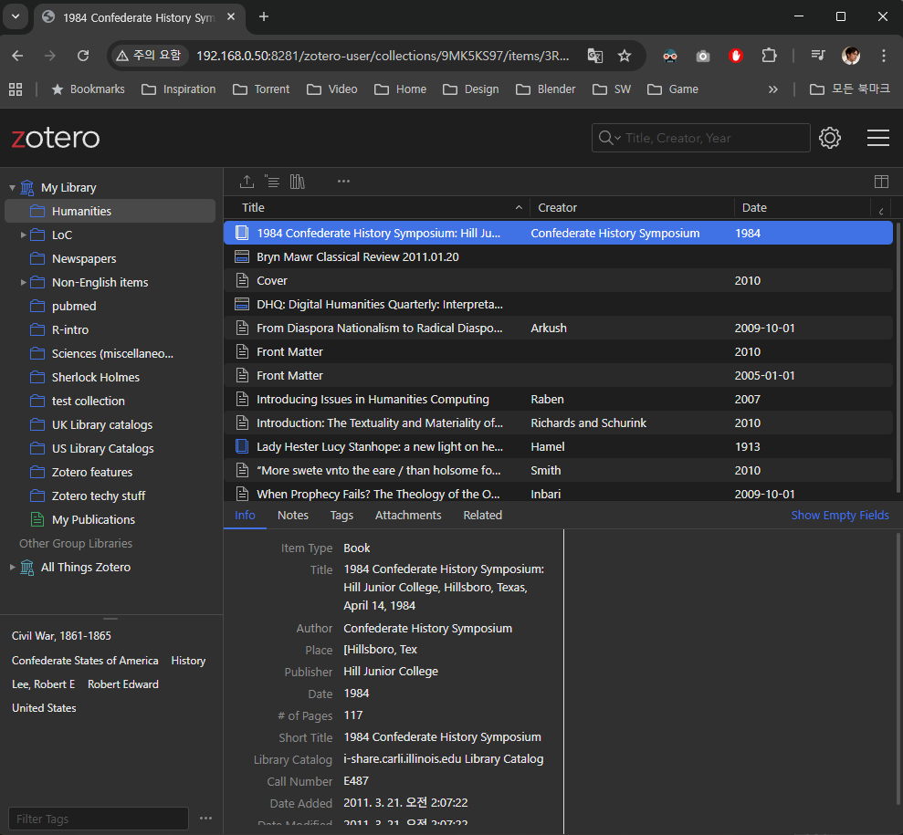

# 📚 On-Prem Zotero WebUI with WebDAV PDF Proxy

**Self-hosted Zotero WebUI Opensource Library + WebDAV-based PDF viewer **Avoid storage fees, keep privacy, and still enjoy a full browser-based Zotero library.

## It is PoC
It(v0.1.13) is still fully not properly works, please keep on watching to be ready for production.

---

## 🚀 Overview

Zotero 7 introduced a new WebDAV sync format where each attachment is stored as:

```
<key>.prop
<key>.zip
```

Stored under the WebDAV root. Zotero always appends `/zotero` to the WebDAV URL (cannot be changed).

This works perfectly for Zotero Desktop — the Standalone app automatically unzips attachments into its local data directory during sync, so users never see the zip-based WebDAV storage structure. When you use Zotero Storage (including paid cloud plans), attachments are also available directly in the Zotero Web Library; this limitation only applies to WebDAV-based setups. but **Zotero Web Library (zotero.org) and the official on-prem web-library cannot open PDFs when using WebDAV**, because attachments remain on your private server and are not hosted by Zotero Storage.

This project provides a clean, fully-self-hosted solution:

```
Zotero Desktop → WebDAV (zip-based)
                      ↓
     On-Prem Web Library (zotero/web-library)
                      ↓
             PDF Proxy (zip → PDF streaming)
```

You get:

* ✔ No Zotero Storage costs
* ✔ Keep all PDFs on-prem (NAS / local server)
* ✔ Modern WebUI to browse your Zotero Library
* ✔ Click-to-open PDFs from the browser
* ✔ Works with Zotero 7 WebDAV zip structure
* ✔ Safe: does NOT modify Zotero’s zip or prop files

---
## Screenshot


## 🧩 Architecture

```
Zotero Desktop (official)
       |
       | WebDAV sync (attachments in <key>.zip)
       v
Synology / Self-hosted WebDAV
       |
       | 1) On-prem Web Library UI (zotero/web-library)
       | 2) PDF Proxy (/pdf/<key>)
       v
Browser → https://pdf.example.com/pdf/<key>
```

### Web Library integration strategy

- Vendor `zotero/web-library` into this repository as a **git subtree** (tracking the upstream `master` branch), so that the Web Library UI and the PDF proxy can be developed and reasoned about together.
- Maintain a clear separation between:
  - The upstream Web Library subtree (read‑only mirror of `zotero/web-library`).
  - A small overlay layer in this repo where on‑prem customizations live (e.g. “Open PDF” button behavior, config).
- Build the self‑hosted Web Library image from this combined code and reference it from `docker-compose.yml`.
- Keep helper scripts in `scripts/` to pull upstream changes and inspect the subtree status.

### What the PDF Proxy does

1. Check if a cached PDF exists at:

   ```
   /zotero/<key>/<extracted.pdf>
   ```
2. If not, open `<key>.zip`, extract the first PDF into:

   ```
   /zotero/<key>/<pdf>
   ```
3. Stream the extracted PDF to the browser (`Content-Type: application/pdf`)

**Zotero itself keeps using **``** for syncing, unchanged.**

---

## 🗂 Folder Layout

### Repository layout (this project)

Planned high-level structure when Web Library subtree is added:

```
/app
  main.py                 # PDF Proxy (FastAPI)
  web-library-upstream/   # git subtree: zotero/web-library (upstream)
  web-library-overlay/    # local on-prem customizations / glue

/scripts
  web-library-subtree-pull.sh
  web-library-subtree-status.sh

WEB_LIBRARY_UPSTREAM_COMMIT  # records current upstream commit for the subtree
```

### Maintainer docs & scripts

- `docs/updating-web-library.md` – subtree pull + release workflow.
- `docs/web-library-overlay.md` – how to organize overlay code and apply it before builds.
- `docs/web-library-build.md` – how to build and serve the combined subtree + overlay Web Library (and build/push the container image).
- `docs/deployment-portainer.md` – GHCR + Portainer stack deployment on Synology.
- `docs/LEGAL.md` – licensing requirements and header templates.
- `scripts/web-library-subtree-*.sh` – helper scripts for pulling and inspecting upstream.
- `scripts/check-release.sh` – runs the subtree cleanliness check; extend it with tests/builds before tagging.
- `scripts/build-web-library-image.sh` / `scripts/build-pdf-proxy-image.sh` – build (and optionally push) the two Docker images locally.

### Zotero 7 WebDAV layout

### Original WebDAV structure (created by Zotero)

```
/zotero
  7A7BDC9P.prop
  7A7BDC9P.zip
  9CDWYJ9A.prop
  9CDWYJ9A.zip
  ...
```

### After PDF Proxy runs (cache folders added)

```
/zotero
  7A7BDC9P.prop
  7A7BDC9P.zip
  7A7BDC9P/               ← created by proxy
     paper.pdf
  9CDWYJ9A.prop
  9CDWYJ9A.zip
  9CDWYJ9A/
     article.pdf
```

---

## 🧪 Getting Started: Test Environment

For local testing, you can run a dev stack that uses synthetic WebDAV data and the embedded Web Library subtree.

1. Generate sample WebDAV data:

   ```bash
   python3 scripts/generate-sample-webdav.py
   ```

2. Copy the example env file and adjust if needed:

   ```bash
   cp .env.dev.example .env.dev
   ```

3. Bring up the dev stack:

   ```bash
   docker compose \
     --env-file .env.dev \
     -f docker-compose.yml \
     -f docker-compose.dev.yml up
   ```

4. Open in your browser:
   - Web Library UI: `http://localhost:8281` (by default)
   - PDF Proxy: `http://localhost:8280/pdf/SAMPLE1`

The sample data generator creates keys like `SAMPLE1` and `SAMPLE2` under `sample-webdav/zotero`, which you can use to exercise PDF opening and error paths.

---

## 🔧 Environment Files

- `.env.dev.example` → `.env.dev`: local dev stack using sample WebDAV data; builds and tags `:dev` images locally.
- `.env.stage.example` → `.env.stage`: staging/NAS stack via `docker compose --env-file .env.stage up -d` (defaults to GHCR `:main` tags).
- `.env.portainer.example` → `.env.portainer`: Portainer stack env file (same vars as staging) when deploying through the UI.
- `.env` remains ignored; keep real secrets/paths out of the repo.
- Metadata config (runtime templating for Web Library): `ZOTERO_API_KEY`, `ZOTERO_API_AUTHORITY_PART`, `ZOTERO_USER_SLUG`, `ZOTERO_USER_ID`, `ZOTERO_INCLUDE_MY_LIBRARY`, `ZOTERO_INCLUDE_USER_GROUPS`, and `ZOTERO_LIBRARIES_INCLUDE_JSON` let you point at zotero.org or an on-prem metadata source. Set these in your env file so the container renders `index.html` with the correct API host/user/groups.
- Attachment routing: set `PDF_PROXY_BASE_URL` to a host the browser can reach (not localhost when accessing via NAS). Attachments/reader will use this proxy.
- Upload gating: `WEB_LIBRARY_ALLOW_UPLOADS=false` (default in on-prem examples) hides/blocks WebUI uploads to Zotero Storage; use Zotero Desktop to sync attachments to WebDAV instead.

### Metadata configuration & troubleshooting

- Set `ZOTERO_USER_SLUG`/`ZOTERO_USER_ID` and `ZOTERO_API_AUTHORITY_PART` to the metadata host you want (defaults to zotero.org).
- Control which libraries load with `ZOTERO_INCLUDE_MY_LIBRARY`, `ZOTERO_INCLUDE_USER_GROUPS`, and `ZOTERO_LIBRARIES_INCLUDE_JSON` (JSON array of `{ "key": "g123", "name": "Team", "isGroupLibrary": true }`).
- Validate templating by viewing page source for `zotero-web-library-config`; wrong host/key/ID typically shows up as `Failed to fetch` in the browser console.
- For on-prem hosts, ensure the metadata API is reachable from inside the container and that CORS allows the Web Library origin.
- Attachments: ensure `PDF_PROXY_BASE_URL` is reachable from the browser; set `WEB_LIBRARY_ALLOW_UPLOADS=false` to avoid uploading to Zotero Storage and rely on Desktop/WebDAV sync for PDFs.
---

## 🛠 Components

### 1. PDF Proxy (FastAPI)

* Reads WebDAV root directly from filesystem
* Lazy-extraction: only extracts PDF when first requested
* Caches the extracted PDF locally
* Streams to the browser

### 2. Self-Hosted Web Library

This repository embeds `zotero/web-library` as a git subtree and adds a thin on‑prem overlay to provide:

* Web-based library browsing
* Custom “Open PDF” button pointing to:

  ```
  https://pdf.example.com/pdf/<key>
  ```
* A Docker image built from the combined upstream subtree + local overlay, referenced from `docker-compose.yml`.

### 3. Optional Reverse Proxy

* Nginx Proxy Manager or Traefik
* Cloudflare optional

---

## 🚢 Deployment (GHCR + Portainer)

- Images are published to GHCR by the `Publish Docker images` GitHub Actions workflow (runs on `main`, tags, and manual dispatch).
- Repositories:
  - PDF Proxy: `ghcr.io/joonsoome/on-prem-zotero-webui/pdf-proxy`
  - Web Library: `ghcr.io/joonsoome/on-prem-zotero-webui/web-library`
- CI uses the built-in `GITHUB_TOKEN` with `packages: write` (no extra registry secrets needed in the repo).
- Synology / Portainer flow:
  1. Add a GHCR registry in Portainer (`ghcr.io`, GitHub username, PAT with `read:packages`).
  2. Copy `.env.portainer.example` → `.env.portainer`, set `ZOTERO_ROOT_HOST_PATH`, ports, and the image tags you want to deploy.
  3. Use `docker-compose.yml` as the stack file in Portainer (attach `.env.portainer`), or run `docker compose --env-file .env.portainer up -d` on the NAS. For a CLI-only staging host, use `.env.stage` instead.
  4. Full steps and health checks: `docs/deployment-portainer.md`.

## 🐳 Docker Compose (Synology Example)

```yaml
services:
  zotero-pdf-proxy:
    image: ${PDF_PROXY_IMAGE:-ghcr.io/joonsoome/on-prem-zotero-webui/pdf-proxy:main}
    environment:
      - ZOTERO_ROOT=/data/zotero
    volumes:
      - ${ZOTERO_ROOT_HOST_PATH:-/volume1/Reference/zotero}:/data/zotero
    ports:
      - "${PDF_PROXY_PORT:-8280}:8000"
    restart: unless-stopped

  web-library:
    image: ${WEB_LIBRARY_IMAGE:-ghcr.io/joonsoome/on-prem-zotero-webui/web-library:main}
    depends_on:
      - zotero-pdf-proxy
    ports:
      - "${WEB_LIBRARY_PORT:-8281}:80"
    restart: unless-stopped
```

With the example env file:

```bash
cp .env.portainer.example .env.portainer
docker compose --env-file .env.portainer up -d
```

---

## 🧩 Sample `main.py` (FastAPI)

```python
from fastapi import FastAPI, HTTPException
from fastapi.responses import StreamingResponse
import os, zipfile

app = FastAPI()
ZOTERO_ROOT = "/data/zotero"

@app.get("/pdf/{key}")
def get_pdf(key: str):
    folder = os.path.join(ZOTERO_ROOT, key)

    # 1. Cached PDF exists?
    if os.path.isdir(folder):
        for f in os.listdir(folder):
            if f.lower().endswith(".pdf"):
                return stream_pdf(os.path.join(folder, f))

    # 2. Otherwise: extract from <key>.zip
    zip_path = os.path.join(ZOTERO_ROOT, f"{key}.zip")
    if not os.path.exists(zip_path):
        raise HTTPException(404, "No zip found")

    os.makedirs(folder, exist_ok=True)

    with zipfile.ZipFile(zip_path, "r") as z:
        pdfs = [n for n in z.namelist() if n.lower().endswith(".pdf")]
        if not pdfs:
            raise HTTPException(404, "No PDF in zip")
        pdf_name = pdfs[0]
        extracted = os.path.join(folder, os.path.basename(pdf_name))
        z.extract(pdf_name, folder)

    return stream_pdf(extracted)


def stream_pdf(path):
    def iterfile():
        with open(path, "rb") as f:
            while chunk := f.read(8192):
                yield chunk
    return StreamingResponse(iterfile(), media_type="application/pdf")
```

---

## 🌐 Reverse Proxy Setup

In Nginx Proxy Manager:

```
Domain:   pdf.example.com
Forward:  http://NAS_IP:8280
SSL:      Cloudflare or Let's Encrypt
```

Then in Web-Library UI, set each PDF link to:

```
https://pdf.example.com/pdf/<key>
```

---

## 💡 Why This Project Exists

Zotero Web Library cannot display PDFs when using WebDAV, because:

* WebDAV content is private
* Zotero’s web UI cannot fetch files from your NAS
* Zotero 7 stores attachments in zip bundles

This project bridges that gap with:

* A tiny on-prem PDF server
* A self-hosted Web Library
* Zero changes to Zotero sync behavior
* Zero cloud fees

---

## 🛣 Roadmap
- [ ] Batch pre-extraction of all PDFs
- [ ] Thumbnail generator (/thumb/<key>)
- [ ] Simple auth ( **Need to find lightweight opensource solution** , OAuth, API tokens)
- [ ] (Optional) pdf.js viewer integration
- [ ] Better WebUI integration (custom toolbar button)
- [x] Add `zotero/web-library` as a git subtree and wire a custom “Open PDF” button that targets this proxy
- [x] Publish Docker images for both the PDF Proxy and the subtree-based Web Library (Docker Hub / GHCR)
- [x] Docker-Compose (Portainer) For Synology Container Manager
* [ ] (Optional) Generic Linux Docker-Compose

---

## 📜 License

This project is licensed under the **GNU Affero General Public License v3.0 (AGPLv3)**.

It includes and modifies the Zotero Web Library, which is:

- Licensed under AGPLv3
- © Corporation for Digital Scholarship

By using or deploying this project, you must provide access to the corresponding source code of the running service in accordance with AGPLv3. See `docs/LEGAL.md` for notice/header details.

---

## ❤️ Contributions

Issues and PRs welcome!
If you're also running Zotero with WebDAV on a NAS or HomeLab, this project was built for you.

---
